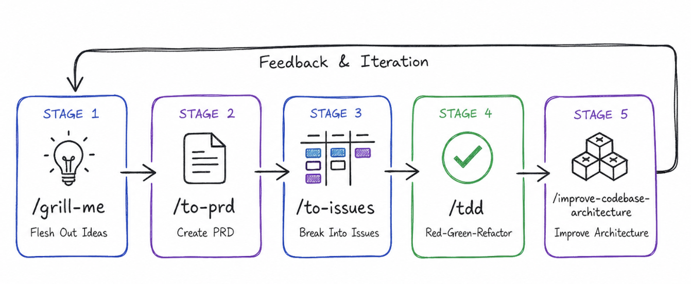

# Matt Pocock 스킬 사용 흐름

`mattpocock/skills`를 사용할 때 참고하는 아이디어 발굴부터 구현·구조 개선까지의 반복 흐름이다. 이 문서는 사용자 제공 스크린샷에 표시된 명령과 목적을 기록한 것이며, 명령을 자동으로 실행하거나 모든 프로젝트에 강제하지 않는다.



## 단계

| 단계 | 명령 | 목적 | 결과 |
| --- | --- | --- | --- |
| 1 | `/grill-me` | 아이디어를 질문으로 구체화하고 빠진 조건을 확인 | 정리된 문제·아이디어 |
| 2 | `/to-prd` | 구체화한 아이디어를 제품 요구사항 문서로 전환 | PRD |
| 3 | `/to-issues` | PRD를 구현 가능한 작업 단위로 분해 | 이슈 목록 |
| 4 | `/tdd` | 테스트를 먼저 작성하고 Red → Green → Refactor로 구현 | 검증된 코드 변경 |
| 5 | `/improve-codebase-architecture` | 구현 결과를 바탕으로 구조적 개선점 검토 | 아키텍처 개선안 또는 변경 |

## 기본 흐름

```text
/grill-me
→ /to-prd
→ /to-issues
→ /tdd
→ /improve-codebase-architecture
→ 피드백·반복
```

5단계 이후에는 개선 결과와 새로 확인된 문제를 1단계의 입력으로 되돌린다. 모든 단계가 항상 필요한 것은 아니며, 이미 PRD나 이슈가 있다면 해당 단계부터 시작한다.

## 다른 영역과의 연결

- 문제의 범위와 원인 정리가 필요하면 [`problem-definition`](problem-definition.md)을 `/grill-me` 전후에 사용한다.
- 제품 발견과 우선순위 판단은 [`docs/skills/product/`](../product/README.md)의 기획 스킬로 연결한다.
- 생성된 이슈의 운영 도구는 프로젝트가 선택한 GitHub Issues 또는 Linear 하나를 따른다.
- 코드 작성 전 선택된 프론트엔드·백엔드 composition과 해당 계층의 하네스를 확인한다.

## 운영 규칙

- 각 명령은 현재 프로젝트에 실제로 설치·연결된 스킬 이름과 일치하는지 먼저 확인한다.
- 명령 결과를 그대로 사실로 확정하지 않고, 담당자 검토 후 다음 단계의 입력으로 사용한다.
- `/tdd`는 구현이 필요한 경우에만 사용한다. 문서 변경에는 불필요한 테스트 단계를 강제하지 않는다.
- 아키텍처 개선은 근거가 있는 변경만 반영하고, 단순한 미래 가능성만으로 구조를 확장하지 않는다.

## 출처와 보관

- 외부 출처: [mattpocock/skills](https://github.com/mattpocock/skills)
- 이미지: [`assets/mattpocock-workflow.png`](assets/mattpocock-workflow.png)
- 적용 범위: 공통 엔지니어링 루프
